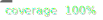

# react-use-path

[](./coverage/index.html)
[](./coverage/index.html)

React Path Hook - Manage navigation paths as JavaScript arrays


[Sacercode](https://sacercode.fr)'s founder, [edocode](https://hedocode.github.io) created this hook for managing and navigating paths represented as JavaScript arrays. Ideal for creating navigation interfaces, breadcrumbs, or file explorers.

## Installation

```bash
npm install @sacercode/react-use-path
```

Or from GitHub :

```bash
npm install git+https://github.com/Sacercode/react-use-path.git
```

## Usage

```jsx
import React from 'react'
import { usePath } from '@sacercode/react-use-path'

const MyComponent = () => {
    const { currentPath, currentPathString, goTo, goBack, goHome } = usePath(
        (newPath) => {
            console.log('Path changed:', newPath)
        }
    )

    return (
        <div>
            <div>Current path: /{currentPathString}</div>
            <div>Path, separated by commas : {currentPath.join(", ")}</div>
            
            {/* Relative navigation */}
            <button onClick={() => goTo('documents/photos')}>
                Go to documents/photos
            </button>
            
            {/* Absolute navigation */}
            <button onClick={() => goTo('/users/john/downloads')}>
                Go to /users/john/downloads
            </button>
            
            {/* Navigating to parent folders */}
            <button onClick={() => goTo('../videos')}>
                Go to sibling videos folder
            </button>
            
            <button onClick={goBack}>Go back</button>
            <button onClick={goHome}>Go home</button>
        </div>
    )
}
```

### API

The `usePath` hook returns an object with :

- `currentPath` : `string[]` - The current path as an array
- `goTo(path: string)` : Navigate to given path
  - Relative path : `"folder1/folder2"` adds to current path
  - Absolute path : `"/folder1/folder2"` replace current path
  - Allows parent folder (`..`) and current one (`.`)
- `goBack(index?: number)` : Go back to previous path or to specific index (starting from 0)
- `goHome()` : Returns to root. (`[]`)
- `setCurrentPath(path: string[])` : Defines a new path from an array

### Paths examples

| Type | Example | Result |
|------|---------|----------|
| Relative | `"documents/photos"` | Adds to current path |
| Absolu | `"/documents/photos"` | Replace the current path |
| Parent | `"../videos"` | Get back once and goes into the videos folder |
| Complex | `"/users/../home/./docs"` | Goes to`/home/docs` |
| Root | `"/"` | Get back to the root level `[]` |

See [/example/src/App.jsx](/example/src/App.jsx) for a complete example.

## Développement

Installing dependancies :
```bash
npm install
```

Building the library :
```bash
npm run build
```

Tests :
```bash
npm test
```

Development with watch :
```bash
npm run dev
```

Testing the example app :
```bash
cd example
npm install
npm run dev
```

## 🧪 Testing & Coverage

This project maintains 100% test coverage. Run the tests with:

```bash
npm test          # Run tests in watch mode
npm run coverage  # Generate coverage report
npm run update-badges  # Update coverage badges
```

The coverage badge above is automatically updated and links to the full coverage report.

## License

[MIT](./LICENCE.md) © [Sacercode](https://sacercode.fr)

